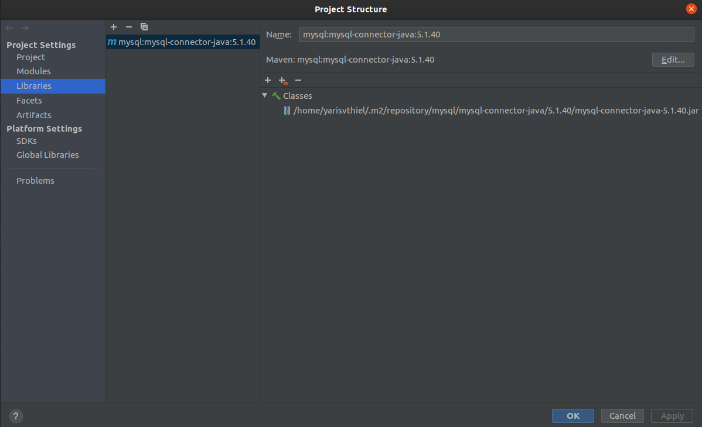

## ORF Predictor group 4
* Armin van Eldik
* Morgan Atmodimedjo
* Yaris van Thiel

### Add mysql-connector library to libraries in IntelliJ:
1. Select **File**
2. Select **Project Structure**
3. Select **Libraries**
4. Click the plus sign (+), then **From Maven**
5. Search for **mysql:mysql-connector-java:5.1.40**
6. Click **Ok**, then **Apply**

Your project structure should look as follows:

